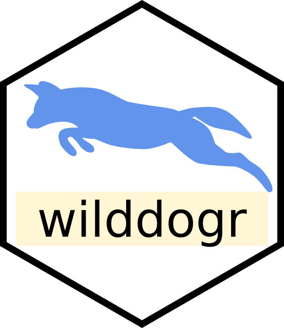
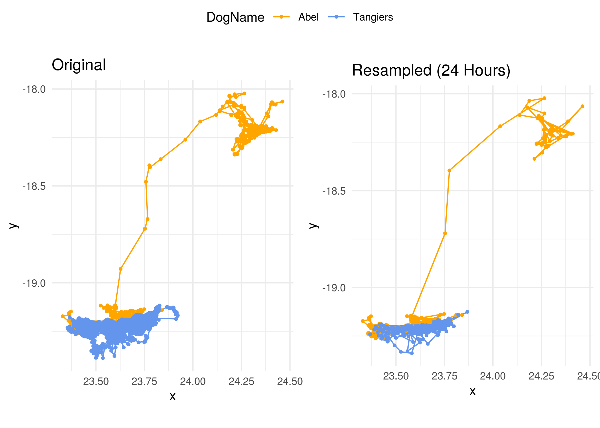

# wilddogr 

`wilddogr` is an R-package that allows you to automatically download and clean
GPS data of wild dogs stored on Dropbox. For this, you'll need to have access to
the "KML-Dispersers" folder.

## Installation
To install `wilddogr` you need to have the package `devtools` installed. You can
then install `wilddogr` using:

```r
devtools::install_github("DavidDHofmann/wilddogr")
```

## Workflow
The `wilddogr` package follows a two-step process using the functions,
`dog_files()` and `dog_download()`.

1. `dog_files()` This function is used to retrieve information on all files
containing GPS data in the KML-Dispersers folder on Dropbox. You can use the
returned dataframe to subset to the files you're interested in. The dataframe
then serves as input to the `dog_download()` function.

2. `dog_download()` Once you have selected the files you're interested in,
download them using `dog_download()`. The function allows you to specify if you
want to download the raw data (`clean = F`) or if you'd like to have the data
pre-processed (`clean = T`). By default, the function directly returns the
filepaths to the downloaded files so that you can easily load it into your
r-session.

In addition, there's a helper function `dog_download_all()` that serves to
simply download all GPS data that's available on Dropbox. For further details
and options, check the help files for the different functions.

Finally, the function `resampleFixes()` can be used to coarsen the regularize
the temporal resolution of the GPS data to a specified value (e.g. 4-hours or
24-hours).

## Example
Here is a little example of the above outlined workflow

```r
# Load required packages
library(wilddogr)
library(ggpubr)

# Identify files on dropbox (including the rvc data)
files <- dog_files(rvc = T)

# Let's take a look at the files we could download
head(files)

# Subset to the files of interest
todownload <- subset(files, DogName %in% c("Abel", "Tangiers"))

# Download the data
downloaded <- dog_download(
    x         = todownload
  , clean     = T
  , overwrite = T
  , outdir    = tempdir()
  , printpath = T
)

# Let's take a look at the data
dat <- read_csv(downloaded)
head(dat)

# We can also coarsen it to 24 hours
dat_res <- resampleFixes(dat, hours = 24, start = 7, tol = 0.5)

# Plot the original and resampled data
p1 <- ggplot(dat, aes(x = x, y = y, col = as.factor(DogName))) +
  geom_path() +
  geom_point(size = 0.8) +
  coord_equal() +
  theme_minimal() +
  scale_color_manual(values = c("orange", "cornflowerblue"), name = "DogName") +
  ggtitle("Original")
p2 <- ggplot(dat_res, aes(x = x, y = y, col = as.factor(DogName))) +
  geom_path() +
  geom_point(size = 0.8) +
  coord_equal() +
  theme_minimal() +
  scale_color_manual(values = c("orange", "cornflowerblue"), name = "DogName") +
  ggtitle("Resampled")
p <- ggarrange(p1, p2, common.legend = T)
```


